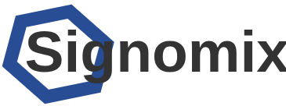

# Signomix Demo

Wersja demonstracyjna Signomiksa prezentuje funkcjonalności platformy z uwzględnieniem funkcjonalności dedykowanych dla wersji Enterprise. Możesz przetestować wszystkie funkcje, które są dostępne w wersji Enterprise, w tym:
- konfigurowalną stronę główną
- whitelabbeling (konfigurowalne logo i kolorystyka)
- szablony pulpitów
- pulpity prezentujące dane z wykorzystaniem różnych kontrolek
- reguły analizy danych przychodzących
- zarządzanie użytkownikami
- zarządzanie urządzeniami (źródłami danych)
- zarządzanie zadaniami cyklicznymi
- dostęp do dedykowanej dokumentacji organizacji dla zalogowanych użytkowników

W celach demonstracyjnych w serwisie cloud.signomix.com została zarejestrowana fikcyjna firma "Signomix Demo Sp. z o.o.". Firma ta wdraża rozwiązanie IoT i monitoruje uruchomione w swojej siedzibie urządzenia. Po zalogowaniu się na konto jej pracownika, możesz zapoznać się z większością z wymienionych powyżej funkcjonalności wersji Enterprise. Jeżeli czytasz ten tekst, to znaczy, że jesteś zalogowany.

Urządzenia tutaj prezentowane są wirtualnymi kopiami rzeczywistych urządzeń, więc nie ma możliwości zaprezentowania funkcjonalności związanych z przesyłaniem do nich danych sterujących.

Jeśli jesteś zainteresowany prezentacją wszystkich funkcjonalności platformy lub chcesz uzyskać więcej informacji, skontaktuj się ze mną wysyłając e-mail na adres g.skorupa@experiot.pl.
